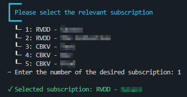

# Introduction
This folder contains two scripts that can be used for mapping Microsoft Sentinel incidents and analytic rules to the MITRE ATT&CK framework. Both scripts (named map-analytics and map-incidents) are written in Powershell, and can be run in an interactive or non-interactive mode. The scripts allow you to filter for certain statuses  or data connectors, so you have more control over which analytic rules and incidents you want to map.

# Benefits
As you might know, Microsoft Sentinel has default support for mapping analytic rules and hunting queries to the MITRE ATT&CK framework via the MITRE ATT&CK blade in Sentinel. So why would I write a script to do the same? 

In my opinion, there are a couple of problems with the MITRE ATT&CK blade in Microsoft Sentinel:
- No option to export the MITRE JSON file to use it in the ATT&CK Navigator 
- Supported version of the ATT&CK framework is running behind in most cases
- No ability to map incidents to the matrix view
- No ability to filter on analytic rules based on data source, and create a simulated map of the templates with data source filtering

With these two scripts, we are able to tackle the problems of the Sentinel MITRE ATT&CK blade described above. The current supported versions of the MITRE ATT&CK framework are v13 and v14, where the scripts will default to the latest version if the version parameter is not set.

# How to use the scripts

## Map analytic rules to MITRE ATT&CK
To map analytic rules to the MITRE ATT&CK framework, we use the map-analytics.ps1 script. This script can be run in both an interactive or a non-interactive mode, making it suitable as an CLI tool or a tool to be used in your automation pipelines. 

### Global parameters and flags
Regardless of which mode you use, there are always two parameters and one flag that needs to be set:

| Parameter | isRequired? | Description |
| --- | --- | --- |
| `resourceGroupName` | true | The name of the resource group where the Sentinel workspace resides. |
| `workspaceName` | true | The name of the Sentinel Log Analytics workspace. |
| `attackVersion` | false | The version of the ATT&CK franework you want to use. |

| Flag | isRequired? | Description |
| --- | --- | --- |
| `interactive` or `noninteractive` | true | The flags used to run in interactive or noninteractive mode |

### Interactive mode
When running in interactive mode, no additional parameters needs to be set. The script will use the `Connect-AzAccount` module to prompt you to log into the Azure tenant of the related Sentinel workspace. Once you have successfully logged-in, the script will ask a couple of inputs:

1. First the script will show the subscriptions you have access to, and will ask you to choose the correct subscription.

2. Secondly, the script will ask which kind of analytic rules you want to map. Here you can choose between 'alertRules' (used to map active analytic rules) and 'alertRuleTemplates' (used to map analytic rule templates).

3. Lastly, the script will ask you if you want to filter based on data connector. You will get a list of all known data connectors which you can use in the filter. If you do not want to filter on data connector, you can use 'all' instead.

**Example:**

`.\map-analytics.ps1 -resourceGroupName "<resource-group-name>" -workspaceName "<workspace-name>" -interactive`

### Non-interactive mode
When running in non-interactive mode, there are a couple of extra parameters that needs to be set. It is important to note that the **non-interactive mode uses an App Registration and the client credentials authentication flow to authenticate to the Microsoft Sentinel workspace**. This means that you will need to have an App Registration with a valid client secret, and an Enterprise Application with the Microsoft Sentinel Reader RBAC role on the relevant Sentinel workspace. The parameters for non-interactive mode are the following:

| Parameter | isRequired? | Description |
| --- | --- | --- |
| `subscriptionId` | true | The id of the subscription where the Sentinel workspace lives. |
| `appId` | true | The application id of the App Registration you are using to login. |
| `secret` | true | The client secret configured on the App Registration to login. |
| `tenantId` | true | The tenant id of the tenant you are logging into. |
| `alertRuleType` | true | The type of analytic rules you want to map. Possible values are 'alertRules' or 'alertRuleTemplates'. |
| `dataConnectorFilter` | false | The filter of relevant data connectors. Possible values can be found in lookuptable/data_sources.json. Default value is set to 'all', meaning no data connector filter. |

**Examples:**

- Mapping all active analytic rules: `.\map-analytics.ps1 -resourceGroupName "<resource-group-name>" -workspaceName "<workspace-name>" -noninteractive -subscriptionId "<sub-id>" -appId "<app-id>" -secret "<app-secret>" -tenantId "<tenant-id>" -alertRuleType "alertRules"`
- Mapping templates related to zscaler: `.\map-analytics.ps1 -resourceGroupName "<resource-group-name>" -workspaceName "<workspace-name>" -noninteractive -subscriptionId "<sub-id>" -appId "<app-id>" -secret "<app-secret>" -tenantId "<tenant-id>" -alertRuleType "alertRuleTemplates" -dataConnectorFilter "Zscaler"`
- Mapping active analytics related to zscaler for version 13: `.\map-analytics.ps1 -resourceGroupName "<resource-group-name>" -workspaceName "<workspace-name>" -attackVersion "13" -noninteractive -subscriptionId "<sub-id>" -appId "<app-id>" -secret "<app-secret>" -tenantId "<tenant-id>" -alertRuleType "alertRules" -dataConnectorFilter "Zscaler"`

### Outputs
The script will show a couple of statistics when all inputs are provided. These are how many analytic rules were retrieved, how many there are after filtering, and how many related techniques there are:

We also show the techniques matrix:

**The generated ATT&CK layers are placed into the 'layers' folder**. The file will get the name '\<alertRuleType>-\<filter>.json', which you can use to import in the MITRE ATT&CK navigator.

Once you have imported the layer into the ATT&CK Navigator, you will see the techniques that have related analytic rule mappings. The score of the technique shows how many analytic rule mappings there are, red being a high amount of rules and green being a low amount of rules. The max value of the scores is set to the technique with the highest score. In the metadata field called 'Related alert rules' you will also find the names of the analytic rules that map to the techniques. 

## Map incidents to MITRE ATT&CK
To map incidents to the MITRE ATT&CK framework, we use the map-incidents.ps1 script. This script can be run in both an interactive or a non-interactive mode, making it suitable as an CLI tool or a tool to be used in your automation pipelines. 

### Global parameters and flags
Regardless of which mode you use, there are always two parameters and one flag that needs to be set:

| Parameter | isRequired? | Description |
| --- | --- | --- |
| `resourceGroupName` | true | The name of the resource group where the Sentinel workspace resides. |
| `workspaceName` | true | The name of the Sentinel Log Analytics workspace. |
| `attackVersion` | false | The version of the ATT&CK franework you want to use. |

| Flag | isRequired? | Description |
| --- | --- | --- |
| `interactive` or `noninteractive` | true | The flags used to run in interactive or noninteractive mode |

### Interactive mode
When running in interactive mode, no additional parameters needs to be set. The script will use the `Connect-AzAccount` module to prompt you to log into the Azure tenant of the related Sentinel workspace. Once you have successfully logged-in, the script will ask a couple of inputs:

1. First the script will show the subscriptions you have access to, and will ask you to choose the correct subscription.

2. Secondly, the script will ask if you want to filter based on the status of the incidents. You can choose a combination of 'New', 'Active', and 'Closed', or you can choose to not filter based on the status.

3. Next, you can choose to filter based on the provider who generated the incident. You can choose a specific provider, all providers from the defender suite, or no filter based on providers.

4. Lastly, you can choose the maximum age of the incidents you want to return.

**Example:**

`.\map-incidents.ps1 -resourceGroupName "<resource-group-name>" -workspaceName "<workspace-name>" -interactive`

### Non-interactive mode
When running in non-interactive mode, there are a couple of extra parameters that needs to be set. It is important to note that the **non-interactive mode uses an App Registration and the client credentials authentication flow to authenticate to the Microsoft Sentinel workspace**. This means that you will need to have an App Registration with a valid client secret, and an Enterprise Application with the Microsoft Sentinel Reader RBAC role on the relevant Sentinel workspace. The parameters for non-interactive mode are the following:

| Parameter | isRequired? | Description |
| --- | --- | --- |
| `subscriptionId` | true | The id of the subscription where the Sentinel workspace lives. |
| `appId` | true | The application id of the App Registration you are using to login. |
| `secret` | true | The client secret configured on the App Registration to login. |
| `tenantId` | true | The tenant id of the tenant you are logging into. |
| `statusFilter` | false | The filter you can use to filter the status of the incidents. This filter is an array where you can create all combinations based on 'New', 'Active', and 'Closed'. If you want all statuses , you can just add 'all' to the array. Default value is @('all'). |
| `providerFilter` | false | The filter you can use to filter based on the provider. This filter is an array where you can create all combinations based on "Azure Advanced Threat Protection", "Azure Security Center", "Azure Sentinel", "Microsoft 365 Defender", "Microsoft Cloud App Security", "Microsoft Defender Advanced Threat Protection", "Office 365 Advanced Threat Protection", "Azure Defender for IoT". If you want all providers, you can just add 'all' to the array. Default value is @('all'). |
| `lookback` | false | The lookback period for the incidents. Default value is 30. |

**Examples:**

- Mapping all incidents of the past 30 days: `.\map-incidents.ps1 -resourceGroupName "<resource-group-name>" -workspaceName "<workspace-name>" -noninteractive -subscriptionId "<sub-id>" -appId "<app-id>" -secret "<app-secret>" -tenantId "<tenant-id>"`
- Mapping new and active incidents of the past 90 days: `.\map-incidents.ps1 -resourceGroupName "<resource-group-name>" -workspaceName "<workspace-name>" -noninteractive -subscriptionId "<sub-id>" -appId "<app-id>" -secret "<app-secret>" -tenantId "<tenant-id>" -statusFilter @("New","Active") -lookback "90"`
- Mapping closed incidents of Defender for Identity the past 60 days in version 13: `.\map-incidents.ps1 -resourceGroupName "<resource-group-name>" -workspaceName "<workspace-name>" -attackVersion "13" -noninteractive -subscriptionId "<sub-id>" -appId "<app-id>" -secret "<app-secret>" -tenantId "<tenant-id>" -statusFilter @("Closed") -providerFilter @("Azure Advanced Threat Protection") -lookback "60"`

### Outputs
The script will show a couple of statistics when all inputs are provided. These are how many incidents were retrieved, how many there are after filtering, and how many related techniques there are:

We also show the techniques matrix:

**The generated ATT&CK layers are placed into the 'layers' folder**. The file will get the name 'incidents-\<filter>.json', which you can use to import in the MITRE ATT&CK navigator.

Once you have imported the layer into the ATT&CK Navigator, you will see the techniques that have related incidents mappings. The score of the technique shows how many incidents mappings there are, red being a high amount of rules and green being a low amount of rules. The max value of the scores is set to the technique with the highest score. In the link field you will also find the related incident IDs and the Azure Portal links to the related incidents. 

# Other related projects
## Dettectinator
A couple of months after I started creating these scripts, I stumbled across the Dettectinator project (https://github.com/siriussecurity/dettectinator) which tries to tackle the same issues I was trying to solve. Dettectinator also makes it possible to export dettections from different SIEM systems, but maps it to the DETT&CT framework. When this mapping is done, you can convert the DETT&CT layer to an ATT&CK layer, and accomplish the same goal you accomplish with these scripts. The difference between these two projects is that this project calculates the score based on the amount of related analytic rules, while Dettectinator sets the score to the data_quality field of DETT&CT. This project also has more filtering capabilities, which are limited in the Dettectinator project. In the future, it would be awesome to merge the features of this project with the Dettectinator project.

# Future improvements
The two scripts still need some improvements in the future to make them even more powerfull:
- More error-handling in both the interactive and non-interactive modes
- ~~Support for more MITRE Layer versions~~
- Merger of these features with the Dettectinator project (https://github.com/siriussecurity/dettectinator) 
- Support for custom colors
- Support for filtering on custom created analytic rules
- Add support for MITRE filters
- Add support for Mobile and ICS layers

