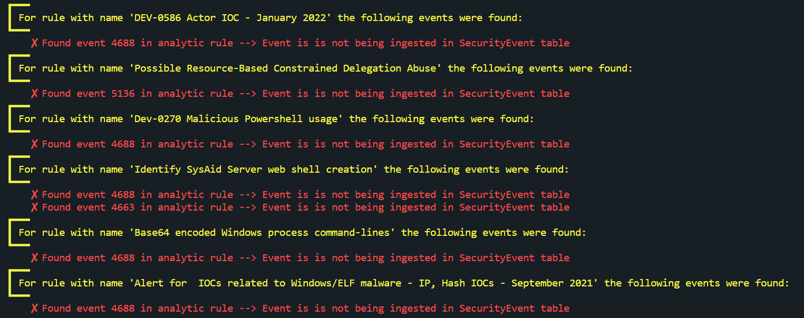
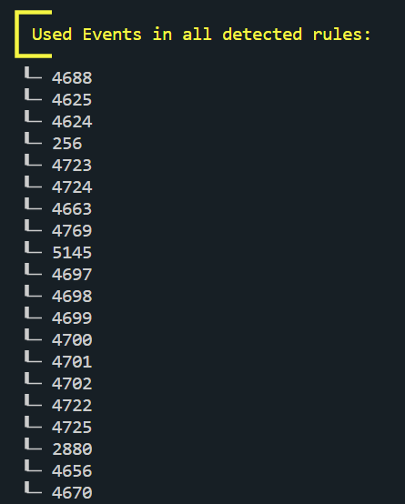
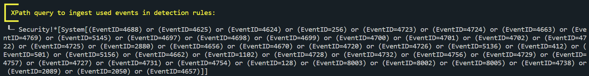

# Windows Security Event Gap Checker

## Introduction

This script checks which Windows Security Event IDs are being used in Microsoft Sentinel analytic rules, and if they are being ingested in Microsoft Sentinel. The check on whether the Event IDs are ingested, is done by querying the SecurityEvents table for the past X days. This can help identify data mapping gaps that are otherwise hard to spot.

The scipt can run into two modes, which are the 'autoCheck' and 'armTemplate' mode. The 'autoCheck' mode will get all the analytic rules from a workspace, and check the used Event IDs for these. The 'armTemplate' mode expects a directory with exported ARM Templates of the analytic rules, and uses these to check the used Event IDs.

For both modes, the script will tell you for every analytic rule which Windows Security Events is used, and whether that Event ID is found in the SecurityEvent table or not. At the end, all EventIDs used in the analyzed analytic rules are shown, and an XPath query is generated to ingest the found EventIDs in Microsoft Sentinel. 

After using this script, you should be able to identify EventIDs that your analytic rules use but are currently not found in the SecurityEvents table. And you should have the XPath query that you can use in Data Collection Rules to start ingestion the EventIDs you need for your detections to work.

## Parmeters

Since the script runs into two modes, there are certain global parameters and other paramaters that are only needed when certain flags are set.

### Global parameters 

The following parameters are needed regardless of the mode u use.

| Parameter | isRequired? | Description |
| --- | --- | --- |
| `subscriptionId` | true | The subscription id of the Sentinel workspace that will be checked for current ingested Event IDs. |
| `workspaceId` | true | The workspace id of the Sentinel workspace that will be checked for current ingested Event IDs. |
| `timespan` | false | The lookup period in days of previously ingested Event IDs. Default is 7 days. |

### Parameters for ArmTemplate mode

The following parameters are needed if you want to use the ArmTemplate mode.

| Parameter | isRequired? | Description |
| --- | --- | --- |
| `useArmTemplates` | false | Flag that needs to be set when you want to use 'armTemplate' mode. |
| `analyticsArmFolder` | true (only for this mode) | Folder that contains ARM Templates of analytic rules that needs to be checked. |

### Parameters for autoCheck mode

The following parameters are needed if you want to use the autoCheck mode.

| Parameter | isRequired? | Description |
| --- | --- | --- |
| `useAutoCheck` | false | Flag that needs to be set when you want to use 'autoCheck' mode. |
| `resourceGroupName` | true (only for this mode) | The resource group name of the Sentinel workspace that contains the analytic rules that needs to be checked. |
| `workspaceName` | true (only for this mode) | The workspace name of the Sentinel workspace that contains the analytic rules that needs to be checked. |

## Examples

### ArmTemplate mode
`.\windows_events_checker.ps1 -useArmTemplates -subscriptionId <subscriptionId> -workspaceId <workspaceId> -analyticsArmFolder <folderPath> [-timespan <int in days>]`

### AutoCheck mode
`.\windows_events_checker.ps1 -useAutoCheck -subscriptionId <subscriptionId> -workspaceId <workspaceId> -resourceGroupName <resourceGroupName> -workspaceName <workspaceName> [-timespan <int in days>]`

### Outputs
Below you will find three screenshots about the outputs you should receive from the script.

**Event IDs found per rule, and whether they where ingested**

**All found Event IDs** 

**XPath query to ingest needed events**

## Known Issues

### Detecting events configuered as numbers in lists
This script detectes Windows Security Events with a regex expression. The expression currently used is:

>       $match = Select-String 'EventID==(\d{3,4})|EventID == (\d{3,4})|EventID=="(\d{3,4})"|EventID == "(\d{3,4})"|EventID==''(\d{3,4})''|EventID == ''(\d{3,4})''|"((?:\d{3,4})+)",?|''((?:\d{3,4})+)'',?|\((\d{3,4}),?|[,\s]((?:\d{3,4})+)[,\s]|((?:\d{3,4})+)(?=\))' -InputObject $query -AllMatches

This means that the following patterns are being detected:
- EventID==[id]
- EventID == [id]
- EventID=="[id]"
- EventID == "[id]"
- EventID=='[id]'
- EventID == '[id]'
- EventID in ("[id]","[id]","[id]",...) --> Can also contain spaced in between
- EventID in ('[id]','[id]','[id]',...) --> Can also contain spaced in between
- EventID in ([id], [id], [id],...)

However, since it was hard to detect EventIDs configured as numbers in the middle of a list (like in the last situation), it can happen that the regex detects some numbers being 3 or 4 characters long that are not used as EventIDs in the query. Therefore, I advise to always check if the detected IDs are real Windows Security Event IDs.
